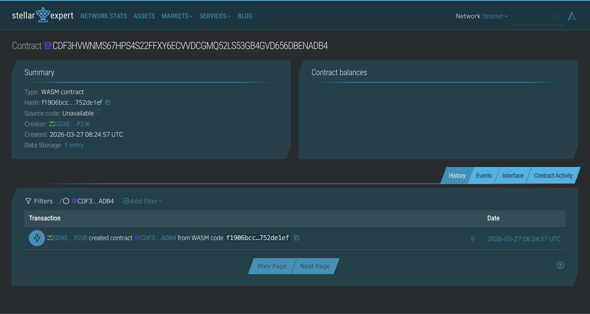

# Soroban Smart Contract

## Project Description

A basic smart contract built using Soroban on the Stellar network.
It demonstrates persistent storage, authentication, and contract interaction.

## What it does

* Stores a value on-chain
* Allows only the owner to update the stored value
* Anyone can read the stored value

## Features

* Persistent contract storage
* Owner-based access control
* Simple and minimal design for learning Soroban
* Easily extensible for real-world use cases

## Deployed Smart Contract Link
https://stellar.expert/explorer/testnet/contract/CDF3HVWNMS67HPS4S22FFXY6ECVVDCGMQ52LS53GB4GVD656DBENADB4

